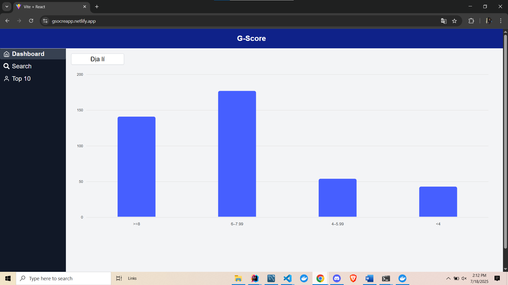
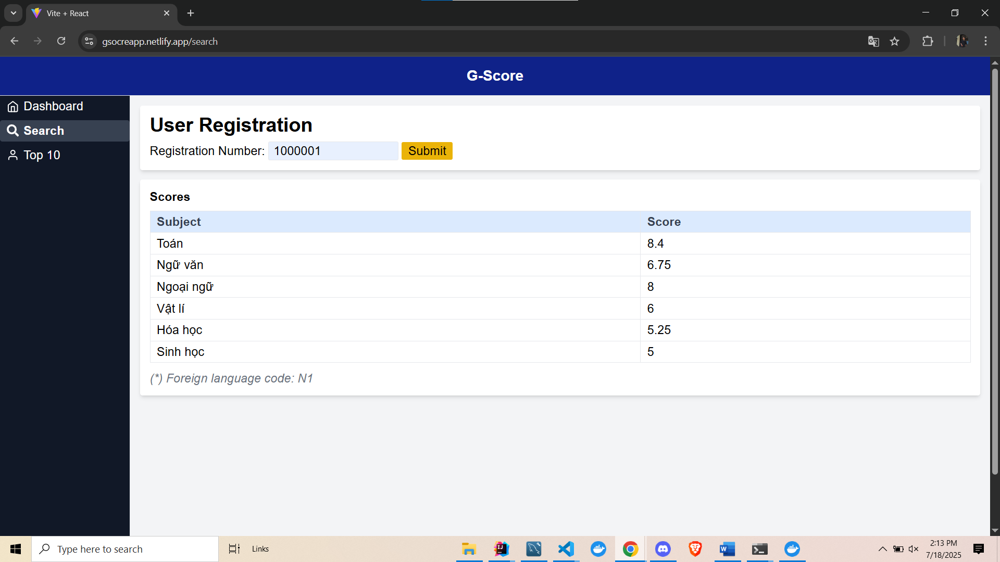
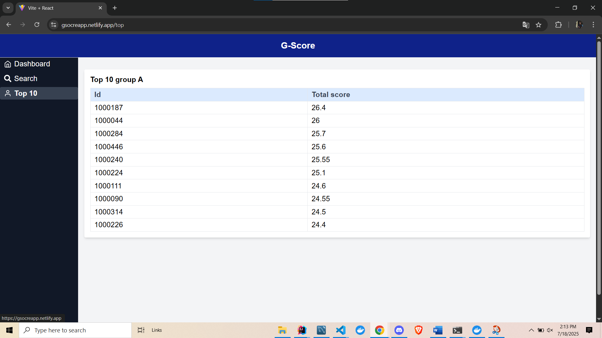

# G-Scores-Frontend

A frontend application for managing and displaying G-Scores.

## Features
Dashboard

Check score from registration

List top 10 students of group A


## Installation

1. **Clone the repository:**
   ```bash
   git clone https://github.com/tanle9t2/G-Scores-Frontend.git
   cd G-Scores-Frontend
   ```

2. **Install dependencies:**
   ```bash
   npm install
   ```

3. **Add .env file**
    ```bash
    VITE_BASE_URL= your backend url
   ```

4. **Run the development server:**
   ```bash
   npm run dev
   ```

5. **Build for production:**
   ```bash
   npm run build
   ```

## Usage Guide

- Open your browser and navigate to the local server address (usually `http://localhost:5173`).
- Use the navigation menu to access different features of the application.
- Make sure your backend service is running and properly configured in the environment variables.

## Run with Docker

You can run the frontend using Docker for easier deployment and environment consistency.

### 1. Build the Docker image

```bash
docker build -t g-scores-frontend .
```

### 2. Run the Docker container

Update the environment variables as needed. You can use a `.env` file or pass them with `-e`.

```bash
docker run -p 5173:5173 --env-file .env g-scores-frontend
```

- The application will be available at [http://localhost:5173](http://localhost:5173).

### 3. (Optional) Docker Compose
```bash
services:
  backend:
    image: tanle92/g-score:v1.0.0
    environment:
      - DB_USERNAME=your username
      - DB_PASSWORD=your password
      - DB_URL=jdbc:mysql://mysql:3306/g_score
      - FRONTEND_URL=frontend:5173
  frontend:
    image: g-scores-frontend
  mysql:
    container_name: mysql
    image: mysql:8.0
    ports:
      - "3307:3306"
    environment:
      MYSQL_ROOT_PASSWORD: your root password
      MYSQL_USER: your username
      MYSQL_PASSWORD: your password

```
If you use docker-compose.yml file, you can use:

```bash
docker-compose up --build
```
---
**Note:**  
- Ensure your backend API is accessible from within the Docker container (check CORS and network settings).
- Adjust the port numbers if you are using a different development server port.

## ‼️Important: At the time you're using it, the data may not have fully loaded yet.
## Link demo: https://gsocreapp.netlify.app/
